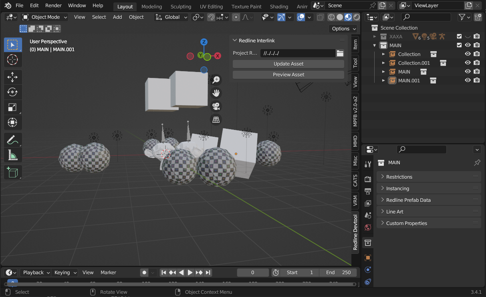

# Redline Studio

A Blender addon for WickedEngine-Demo game development, this turns blender into a game level editor which supports creating common types of components that exists within WickedEngine and this game demo software.

Install by downloading this repo as zip and install through Blender's settings.

## Setup

After installing this addon and you want to create a new level or prefab sets, you first need to set the the project root, click the folder icon on the `Project Root:` text box to set the location to the root of WickedEngine-Demo repository folder.

Make sure you've built the softwares in WickedEngine-Demo repository folder to fully utilize this editor environment.

## Prefabbing

The main feature of this add on is to generate prefabs per collection, the collection that'll be prefabbed will be the collection that is attached directly to the scene's collection.

It'll be exported as BLENDNAME_COLLECTIONNAME

If you use MAIN as the name of the collection, it'll be used as the root prefab of the scene, which will have the scene name be exported as BLENDNAME

Not only that, collections will only be exported if you check `Include in Export` in the menu below (in Colleciton tab of Properties Panel).

Checking `Composite to Main Scene` will automatically make this collection as subsection of `MAIN` collection (if exists).

## What are the components that can be exported to the engine?

* Prefabs
* Rigidbody Physics
* Softbody Physics
* Physics Constraints
* Decals
* Lights
* Cameras(?)
* Sounds
* Force Fields