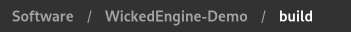
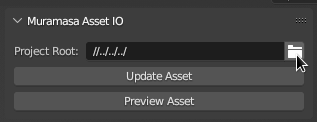

# Setup

## Installation

Save this repository as a zip file and then install them from Blender through **File > User Preferences > Add-ons > Install**.
Install directly by selecting the zipped file of this repository.

## Program Setup

After installing this addon and you want to create a new level or prefab sets, you first need to set the project root, click the folder icon on the `Project Root:` text box to set the location to the root of WickedEngine-Demo repository folder.

Make sure you've built the software in WickedEngine-Demo repository folder to fully utilize this editor environment like the ones below.

## New Blend File Setup

For each new asset you make inside the game project you have to make sure the you put the blend file to the the `Data` folder which inside has the folder `Content` resides in the same folder which the `Dev` or `Dev.exe` executable resides.

Set it up through the `Muramasa Asset IO` panel's `Project Root` property, exists within the right panel tab of `Muramasa SDK`.

