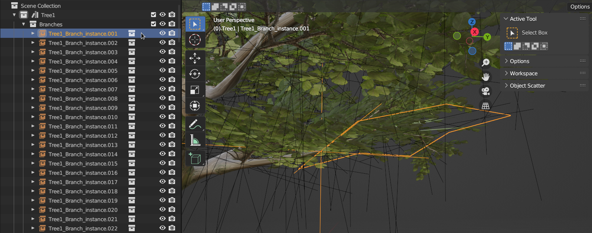

# Working with Prefabs

To author streamable prefabs you can work with managing collections within Blender.

To mark a collection as a prefab, you can mark it as `Include in Export` like the image below. To set a prefab which is not a sub prefab and will have the same name as the blend file, you can turn on `Set This Collection As The Main Scene`.

**To note**: Make sure this collection is the collection which is on the topmost of the hierarchy, means that it is the child of Scene Collection.

&nbsp;

## Composing Scenes with Prefabs

Each of these prefab-enabled Collections can be composed into the main scene prefab to compose the overall scene /  main prefab, the amount of objects to be put within the collection has no limits.

In the image below, you can use `Collection Instance` to append collection of objects that will be loaded spearately from the current prefab.

Make sure that the `Collection Instance` you're currently instancing is also exported by marking it as `Include in Export`!

The `Collection Instance` you're appending to your prefab scene does not need to be in the same blend file, you can actually **Link** Collection as an instance from another blend file or from the library, for example it would be this scene below.

&nbsp;

## Controlling The Streaming Behavior

In the image below, we have options in which can affect how streaming the prefab would be done. There are three variables that affect the streaming behaviour which is `Copy Mode`, `Stream Mode`, and `Streaming Boundary Multiplier`.

**Copy Mode** affects how the prefabs are copied on scene, `Shallow Copy` would only copy necessary object datas that are used to be displayed or interacted upon and reference the same static data for mesh, armature, and animations to reduce memory footprint, this is good for instancing static meshes. 

On the other hand, `Deep Copy` would copy all the object datas for the prefab, which is useful for instancing skeletal meshes or prefab instances with unique animations for each.

**Stream Mode** affects how the prefabs are decided to be loaded into the scene, which can depend on the loading zone of the prefab, or how much would the prefab would occupy the screen.

- `Direct` will automatically load regardless of situations.
- `Distance` will load depending if your player is inside the loading bounding box zone.
- `Screen Estate` will load depending if the prefab occupies certain percent of the overall screen.
- `Manual` will load if you tell the prefab to.

Both `Distance` and `Screen Estate` areas can be affected by changing the value of `Streaming Boundary Multiplier`, in which will multiply the boundary size of the prefab to this value. To make the boundary smaller set the value to be lesser than `1.0`, vice-versa you need to set it bigger than `1.0` to make it bigger.

&nbsp;

## Creating LOD(s) for your Prefab

There will be cases when you want to make sure that a prefab can be seen by the player from afar while it is not being interactable. The solution here is to introduce some kind of proxy prefab that acts as a non-interactable lower detailed summary of the current prefab.

To do this, first you need to have a prefab that can serve as the far LOD of the prefab you need 1 or more LOD with. In the picture below we have `Tree1_Twig` with `Tree1_Twig_LOD` serves as the lower detail counterpart of our prefab. It is required that both **Collections** has been marked as `Include In Export`.

Also just like on the picture above you need to put the LOD prefab as a `Collection Instance` within the target prefab you need LOD with.

Next up is to tell your target prefab that one of the `Collection Instance` of your prefab is going to be assigned as the one of the LOD tier of your scene.

First up you need to select the active collection and then in the collection panel of the properties panel click the `Add Prefab LOD Tier` to add a LOD tier.

Next up is to put the `Collection Instance` you want to set into LOD with into the tier list like in the picture below, just drag the `Collection Instance` object into one of the prefab tier property box as seen below.

You can have more than 1 level of LOD to have more granular control on how the details are handled per distance or screen estate ratio.

Note that the highest tier number would be the one to be loaded first, with the closest to the main prefab would be `Tier 0`. Load in/out are decided similiar to the main prefab which is by distance or screen estate, play around with the LOD prefab's `Streaming Boundary Multiplier` value.

&nbsp;

## Exporting Prefab(s) to Engine

To update all which you've set to `Include In Export` you can do so by pressing `Update All Assets` inside **Muramasa Asset IO** panel in **3D View**.

To only export/update one of the prefab you can select the collection you want to export (make sure that collection has been marked as `Include In Export`) and then press `Update Current Asset`.

If you set the project root directory right, you'll be shown the editor's import process window like below.

Note that the process also includes converting textures from PNG to KTX2 which may take more time, please wait until this text appears on the editor window: `[<-- ! -->] You can close this window now [<-- ! -->]`

&nbsp;

## Previewing Exported Prefab in the Engine

You can press the `Preview Active Asset` to preview the currently active collection from blender within the engine inside the **Muramasa Asset IO** panel in **3D View**.

Which will greet you with this view.

