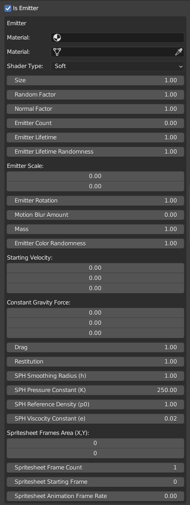

# Authoring Engine & Game Specific Components

While normally the GLTF export option would export all the necessary scene, meshes, objects and animations structure into the file, the exporter cannot transfer engine specific datas that can help to author assets in a more complete manner with the preferred DCC (in this case Blender).

So this addon solves this problem by attaching Wicked Engine and the Game's specific property values into the exported GLTF file which can be properly ingested by the Game's asset import workflow.

Without further ado, below are the custom datas avaiable to be tweaked upon for import to the engine.

&nbsp;

## Object Data

### Location : Properties Editor > Object Editor Tab > Muramasa Object Data


### Values

- **Renderable** : Set object to be rendered into scene or not
- **Cast Shadow** : Set if object's mesh cast shadows
- **Dynamic** : Set if object is dynamic or static
- **Request Planar Reflection** : If the object's material properties has visible amount of reflectiveness and the object is something like a floor or mirror you can request that the object uses planar reflection
- **Emissive Color** : Set object's emissive color
- **Shadow Cascade Mask** : Set if an object's shadows would not be rendered at a certain level of cascade

### Values (Filter)
- **Opaque** : The object is opaque
- **Transparent** : The object is transparent
- **Water** : The object is water
- **Navigation** : The object is occludable by the engine's collision detection pipeline (non bullet)

### Values (Layer Mask)
- Set how the object would be affected by other systems through the layer mask </br> 
- **Use Layer Mask** : Set an object to be filtered through engine's layer mask

### Values (Decal)
- **Is Decal** : Set if this object has a decal component or not </br> 
- **Material** : Set the decal's target material
- **Use BaseColor's Alpha Only** : Set that the decal's material transparency to be affected only by the material's Albedo/Diffuse Color value

### Values (Emitter)
- **Is Emitter** : Set if this object has an emitter component or not </br> Since the engine's emitter particle system is different from blender's, you need to set the one in this **Muramasa Object Data** to create a particle effect within the scene </br> 
- **Material** : Set the particle's material
- **Mesh** : Set the mesh to be used for the particle's emission starting point
- **Shader Type** : Set the shader type to be used for the particle rendering </br> 
- **Size** : The size of the particle
- **Random Factor** : How much randomness does each particle's starting velocity be affected
- **Normal Factor** : How much does the normal of the referred mesh's faces would affect each particle's starting velocity
- **Emitter Lifetime** : How long does the particle persists (in seconds)
- **Emitter Scale** : The width and height of the particle's surface image be shown
- **Emitter Rotation** : Set the particle's clockwise speed (negative for counterclockwise)
- **Motion Blur Amount** : How stretched does the particle be when it is moving, creating a trail similar to motion blur but faked
- **Mass** : The mass of the particle (in Newton)
- **Emitter Color Randomness** : How random does the color that changes for each particle
- **Starting Velocity** : The starting velocity of each particle spawned
- **Constant Gravity Force** : The gravity force that will affect the particle each iteration
- **Drag, Restitution and SPH values** will affect how the particle behaves during it's lifetime
- **Spritesheet Frames Area** : The area of the texture that is going to point as a single frame of the overall animation, starts from the top left, values are in UV coordinate
- **Spritesheet Frame Count** : Amount of frames to play during the particle sim
- **Spritesheet Starting Frame** : The starting frame of the texture animation
- **Spritesheet Animation Frame Rate** : The frame rate of the animation, measured in FPS > 60FPS means 60.0 in the value to be inputted.

### Values (Script)
- **Script File** : The Lua file that is going to be loaded/run to this object, will pass on Entity ID into the script. Leaving the value empty will not export the scripting function attached to this object. </br> 

### Values (Object Variables)
- **Object Variables** will store script-ingested variables that can be edited within blender, these values are exposed when the lua script that you've set before explicitly exposes this </br> 
- **Refresh Object Variables** : Update exposed variables that you can modify for the script in the editor
- On the lua side, you can export the values like below, has to start with `-- MURAMASA_HINT` and then accompanied with the three supported value input: `FLOAT`, `STRING` </br>
```
-- MURAMASA_HINT
-- FLOAT Hit_Point
-- STRING Communication_Type
-- STRING Collider_Type
```
- To access the values inputted within blender to lua, you can access it by getting the `D` table like below.
```
Gameplay_Create_Component_HitData(script_entity, D.Hit_Point, Get_Communication_Type[D.Communication_Type], GET_Collider_Type[D.Collider_Type])
```
- Note that the scripting support currently are only specific to the [Demo Game Project](https://github.com/megumumpkin/WickedEngine-Demo)

## Mesh Data
### Location : Properties Editor > Data Editor Tab > Muramasa Data (Mesh as Object Data)

### Values
- **Renderable** : Set if mesh is rendered into scene
- **Double Sided** : Set if mesh are double sided
- **Dynamic** : Set if mesh is dynamic or not
- **TLAS Force Double Sided** : ???
- **Double Sided Shadow** : Set if the mesh's shadow rendering supports double sided rendering
- **Enable BVH Traversal (for collision test)** : Increase collision performance by using BVH acceleration structure to determine surface contact for the purpose of collision test
- **LOD Mode** : Sets how the mesh LOD is generated </br> 
    - **None** : No LOD is generated for this mesh
    - **Standard** : Wicked Engine will generate multi-level standard LOD for you
    - **HDM** : HLOD like approach for Mesh LOD (like UE5) (CURRENTLY NOT IMPLEMENTED)

## Light Data
### Location : Properties Editor > Data Editor Tab > Muramasa Data (Light as Object Data)

### Values
- **Is Volumetric** : Set if light is volumetric and can cast volumetric shadows
- **Cast Volumetric Cloud Shadows** : Set if light would also cast volumetric shadows from cloud from the weather system
- **Shadow Cascade Distances** : Set each cascade distances for the light (for directional light)